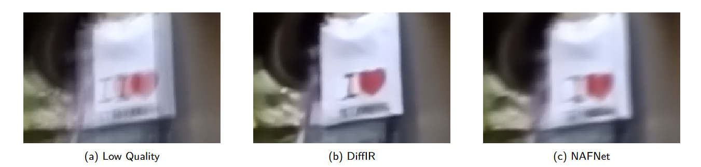
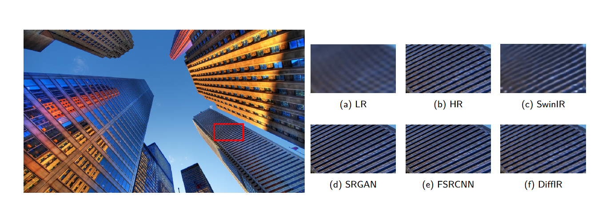

# RestoraVision: A Comprehensive System for Image Enhancement and Restoration

## Contents
1. [Overview](#overview)
2. [Image Super-Resolution](#image-super-resolution)
   - [SwinIR](#swinir)
   - [FSRCNN](#fsrcnn)
   - [SRGAN](#srgan)
   - [DiffIR-SR](#diffir-sr)
3. [Image Deblurring](#image-deblurring)
   - [NAFNet](#nafnet)
   - [DiffIR-Deblur](#diffir-deblur)
4. [Results](#results)

## Overview
RestoraVision is a comprehensive system for image enhancement and restoration. This project leverages five different models: SwinIR, FSRCNN, SRGAN, DiffIR and NAFNet. These models are designed to address various challenges in improving image quality, including upscaling resolution and recovering lost details.

---

## Image Super-Resolution
### FSRCNN
#### Model Overview
FSRCNN (Fast Super-Resolution Convolutional Neural Network) is a CNN-based approach to the Super-Resolution task. It is a single neural network that takes a low-resolution (LR) image as an input, "cleverly" upscales it, and returns a high-resolution (HR) image that is N times larger. N is the upscaling factor defined by the used, in this project N=4. This model represents an advancement from the previous SRCNN (Super-Resolution Convolutional Neural Network), featuring numerous improvements in performance and processing speed. 
FSRCNN performs the super-resolution process without the need for a preliminary interpolation step, which helps to save time and computational resources. Instead, this model operates directly on the low-resolution image, referred to as Ys, to extract the necessary features.
The feature extraction in FSRCNN is the first and crucial step, where the network employs filters to generate high-dimensional feature vectors from batches of images. This enables the model to better understand the essential elements required to reconstruct high-quality images.
The components of FSRCNN include feature extraction, a shrinking layer, non-linear mapping, an expanding layer, and a deconvolution layer. These layers interact to produce higher-resolution images from the initial input data. The design of FSRCNN has proven effective, particularly when it comes to conserving energy and minimizing computational complexity.
Through these enhancements, FSRCNN not only improves image quality but also optimizes processing speed, making it a compelling choice for applications demanding super-resolution.


#### How to use
1. Install the required dependencies:
   ```bash
   pip install -r requirements.txt
   cd FSRCNN
   ```
   Train model: run file FSRCNN-train.py with dataset on Kaggle
   
   Runfile test.py to test model and log metrics:
   ```bash
   python test.py --input-folder "Your-path" 
                  --result-folder "Your output path"
   ```
   default input folder is FSRCNN/dataset/Set5 and result folder is FSRCNN/results

   Runfile infer.py to process the image only:
   ```bash
   python infer.py --input-folder "Your-path" 
                  --result-folder "Your output path"
   ```

 ### SwinIR
 #### Model Overview  
 
SwinIR comprises three main components: shallow feature extraction, deep feature extraction, and high-quality image reconstruction. The shallow feature extraction module uses a convolutional layer to capture low-frequency information, which is directly passed to the reconstruction module. The deep feature extraction module utilizes residual Swin Transformer blocks (RSTBs), incorporating Swin Transformer layers for local attention and cross-window interactions. A convolutional layer at the end of each block enhances features, while  residual connections enable effective feature aggregation. Finally, the reconstruction module fuses shallow and deep features to produce high-quality images. Compared to traditional CNN-based models, SwinIR offers several advantages: (1) content-based interactions between image content and attention weights, functioning similarly to spatially varying convolutions; (2) the ability to model long-range dependencies through the shifted window mechanism; and (3) superior performance with fewer parameters. This combination of benefits allows SwinIR to outperform existing methods for image super-resolution while maintaining efficiency.
 #### How to use
 ```bash
cd SwinIR
python infer.py --image_path your/path/to/image
 ```
The results will be located in the 'output' directory

 ### SRGAN
 #### Model Overview  
 - Architecture: 
 - Details can be found in [SRGAN Report](https://github.com/quaqducc/RestoraVision/blob/main/Image%20Super%20Resolution/SRGAN/Report/SRGAN%20-%2020225467.docx)
 #### How to use
 - Details can be found in [Readme.md](https://github.com/AnKun10/SRGAN-from-scratch/blob/main/README.md)

   
 ### DiffIR-SR
 #### Model Overview  
 - Architecture: 
 - Details can be found in section 3.3 of our report [Report](RestoraVision\Report\Final-Deep-Learning-Project-2024-1.pdf)
 #### How to use
 - Details can be found in [Readme.md](https://github.com/quaqducc/RestoraVision/tree/main/Image%20Super%20Resolution/DiffIR-SR#readme)


## Image Deblurring

### NAFNet
#### Model Overview  
Although there have been significant advances in the field of image restoration recently, the system complexity of the state-of-the-art (SOTA) methods is increasing as well, which may hinder the convenient analysis and comparison of methods.
NAFNet(Nonlinear Activation Free Network) was developed by Liangyu Chen, Xiaojie Chu, Xiangyu Zhang, and Jian Sun. To further simplify the baseline, they reveal that the nonlinear activation functions, e.g. Sigmoid, ReLU, GELU, Softmax, etc. are not necessary: they could be replaced by multiplication or removed.  
Instead, it achieves superior results through simpler methods, such as multiplication or outright removal of these functions.
- Architecture: 
#### How to use
1. Install the required dependencies:
   ```bash
   pip install -r requirements.txt
   cd NAFNet
   ```
2. Install the pretrain model to the ./experiments/pretrained_models directory [NAFNet PreTrain](https://drive.google.com/file/d/1bTowGIb_hKX5laXjDA55CJsn9yLJwFtp/view)

3. Upload images you want to deblur in the ./upload/input directory

4. Run the inference.py file and the results will be shown in ./upload/output directory
   ```bash
   python inference.py
   ```

 ### DiffIR-Deblur
 #### Model Overview  
 - Architecture: 
 - Details can be found in section 3.3 of our report [Report](RestoraVision\Report\Final-Deep-Learning-Project-2024-1.pdf)
 #### How to use
 - Details can be found in [Readme.md](https://github.com/quaqducc/RestoraVision/blob/main/Image%20Deblurring/DiffIR-Deblur/README.md)

## Results
### Result Table of all model
### Image test result of all model
#### Deblur result:
 
#### Super resolution result:
 


