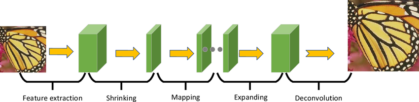

# RestoraVision: A Comprehensive System for Image Enhancement and Restoration

## Contents
1. [Overview](#overview)
2. [Image Super-Resolution](#image-super-resolution)
   - [SwinIR](#swinir)
   - [FSRCNN](#fsrcnn)
   - [SRGAN](#srgan)
3. [Image Restoration](#image-restoration)
   - [Model 4](#model-4)
   - [Model 5](#model-5)
4. [Results](#results)

## Overview
RestoraVision is a comprehensive system for image enhancement and restoration. This project leverages five different models: SwinIR, FSRCNN, SRGAN, and two additional models for super-resolution (SR) and image restoration tasks. These models are designed to address various challenges in improving image quality, including upscaling resolution and recovering lost details.

---

## FSRCNN
### Model Overview
FSRCNN (Fast Super-Resolution Convolutional Neural Network) is a CNN-based approach to the Super-Resolution task. It is a single neural network that takes a low-resolution (LR) image as an input, "cleverly" upscales it, and returns a high-resolution (HR) image that is N times larger. N is the upscaling factor defined by the used, in this project N=4. This model represents an advancement from the previous SRCNN (Super-Resolution Convolutional Neural Network), featuring numerous improvements in performance and processing speed. 
FSRCNN performs the super-resolution process without the need for a preliminary interpolation step, which helps to save time and computational resources. Instead, this model operates directly on the low-resolution image, referred to as Ys, to extract the necessary features.
The feature extraction in FSRCNN is the first and crucial step, where the network employs filters to generate high-dimensional feature vectors from batches of images. This enables the model to better understand the essential elements required to reconstruct high-quality images.
The components of FSRCNN include feature extraction, a shrinking layer, non-linear mapping, an expanding layer, and a deconvolution layer. These layers interact to produce higher-resolution images from the initial input data. The design of FSRCNN has proven effective, particularly when it comes to conserving energy and minimizing computational complexity.
Through these enhancements, FSRCNN not only improves image quality but also optimizes processing speed, making it a compelling choice for applications demanding super-resolution.




### How to use
1. Install the required dependencies:
   ```bash
   pip install -requirements
   cd FSRCNN
   ```
   Train model: run file FSRCNN-train.py with dataset on Kaggle
   
   Runfile test.py to test model and log metrics:
   ```bash
   python test.py --input-folder "Your-path" 
                  --result-folder "Your output path"
   ```
   default input folder is FSRCNN/dataset/Set5 and result folder is FSRCNN/results

   Runfile infer.py to process the image only:
   ```bash
   python infer.py --input-folder "Your-path" 
                  --result-folder "Your output path"
   ```

 ## (Frame)
 ### Model Overview  
 Some overview here
 ### How to use
 ```bash
 pip ákdaksdkas
 ```

## Results
 - Result Table of all model
 - Image test result of all model


